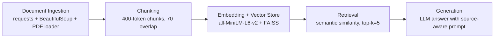

# Project 1 Planning: The Unofficial Guide

> Write this document before you write any pipeline code.
> Your spec and architecture diagram are what you'll use to direct AI tools (Claude, Copilot, etc.) to generate your implementation — the more specific they are, the more useful the generated code will be.
> Update the Retrieval Approach and Chunking Strategy sections if you change your approach during implementation.
> Update this file before starting any stretch features.

---

## Domain

<!-- What domain did you choose? Why is this knowledge valuable and hard to find through official channels? -->

The domain I chose is RIT's CS courses, curriculum, and professors. CS is one of the bigger programs, so students often want to know which professors are recommended and which electives are worth taking. A lot of this decision-making information is spread across many places and is specific to RIT, so it is not easy to find in one official source, especially because much of it is subjective.

---

## Documents

<!-- List your specific sources: URLs, subreddit names, forum threads, or file descriptions.
     Aim for at least 10 sources that together cover different subtopics or perspectives within your domain. -->

| # | Source | Description | URL or location |
|---|--------|-------------|-----------------|
| 1 | RIT CS Electives and Clusters PDF | Official elective/cluster options from RIT CS advising. | https://www.cs.rit.edu/csdocs/Website/ComputerScienceElectivesandClusters.pdf |
| 2 | Reddit thread: CS core class advice | Student opinions on core course difficulty and planning. | https://www.reddit.com/r/rit/comments/122i0uw/need_advice_on_cs_core_classes/ |
| 3 | RIT CS Undergrad Flowchart PDF | Official course sequencing and prerequisite structure. | https://www.cs.rit.edu/csdocs/Website/CSUndergradFlowChart.pdf |
| 4 | Reddit thread: CS minor electives | Student recommendations for elective selection. | https://www.reddit.com/r/rit/comments/1b36mrf/cs_minor_which_electives_to_take/ |
| 5 | Reddit thread: second-year course flow | Workload planning experiences and schedule balance. | https://www.reddit.com/r/rit/comments/1g605qm/second_year_cs_courseflow_is_it_too_much/ |
| 6 | Reddit thread: CS co-ops | Advice and expectations around co-op preparation. | https://www.reddit.com/r/rit/comments/m7h2zu/computer_science_bs_coops/ |
| 7 | Reddit thread: best cluster electives | Popular clusters and reasons students choose them. | https://www.reddit.com/r/rit/comments/1c4b56w/best_cs_cluster_electives/ |
| 8 | Rate My Professors profile A | Professor-specific review trends and class experience notes. | https://www.ratemyprofessors.com/professor/251460 |
| 9 | Rate My Professors profile B | Additional professor feedback for comparison across instructors. | https://www.ratemyprofessors.com/professor/2638596 |
| 10 | Rate My Professors profile C | Additional professor feedback with sentiment examples. | https://www.ratemyprofessors.com/professor/2954361 |

---

## Chunking Strategy

<!-- How will you split documents into chunks?
     State your chunk size (in tokens or characters), overlap size, and explain why those
     numbers fit the structure of your documents.
     A review-heavy corpus warrants different chunking than a long FAQ. -->

**Chunk size:**
400 tokens
**Overlap:**
70
**Reasoning:**
The dataset is mostly short-form, subjective text (Reddit and professor reviews), where smaller chunks preserve tone and specific recommendations. A 70-token overlap keeps adjacent context when advice spans chunk boundaries. This still handles longer PDF passages without creating overly broad chunks that dilute retrieval precision.
---

## Retrieval Approach

<!-- Which embedding model are you using (e.g., all-MiniLM-L6-v2 via sentence-transformers)?
     How many chunks will you retrieve per query (top-k)?
     If you were deploying this for real users and cost wasn't a constraint, what tradeoffs
     would you weigh in choosing a different embedding model — context length, multilingual
     support, accuracy on domain-specific text, latency? -->

**Embedding model:**
all-MiniLM-L6-v2 (SentenceTransformers)

**Top-k:**
5

**Production tradeoff reflection:**
For this class project, all-MiniLM-L6-v2 is a good balance of quality, speed, and simplicity. If cost were not a constraint in production, I would test larger embedding models that usually improve semantic accuracy on nuanced opinion text (for example, mixed sentiment in Reddit threads). The tradeoff is higher latency and compute cost. I would also evaluate models with stronger long-context handling for PDF-derived chunks and compare retrieval quality using real user queries. Since the corpus is English-only and domain-specific, multilingual support is less important than precision on terms like course numbers, professor names, workload, and co-op advice.

---

## Evaluation Plan

<!-- List your 5 test questions with their expected correct answers.
     Questions should be specific enough that you can judge whether the system's response
     is right or wrong. "What are good dining halls?" is too vague.
     "What do students say about wait times at [dining hall name] during lunch?" is testable. -->

| # | Question | Expected answer |
|---|----------|-----------------|
| 1 | What do students say are the biggest factors when choosing CS electives at RIT? | Response should mention common factors seen in Reddit/review sources such as workload, professor teaching style, relevance to career goals, and schedule fit. |
| 2 | How do students describe balancing second-year CS course load at RIT? | Response should summarize that students discuss avoiding overly heavy combinations in one term and planning around difficulty/time demands. |
| 3 | What guidance appears in the sources about preparing for CS co-ops? | Response should mention themes like building projects, practicing interviews/resumes, and planning coursework to be job-ready. |
| 4 | How should a student use official curriculum documents versus student opinion sources? | Response should state official RIT PDFs are authoritative for requirements/prereqs, while Reddit/RMP provide subjective experience context. |
| 5 | What kind of professor-related information can be extracted from review sources? | Response should include themes such as grading strictness, clarity, workload, and class organization, while noting opinions are subjective. |

---

## Anticipated Challenges

<!-- What could go wrong? Name at least two specific risks with reasoning.
     Consider: noisy or inconsistent documents, missing source attribution, off-topic
     retrieval, chunks that split key information across boundaries. -->

1. Noisy and conflicting opinions in Reddit/RMP sources can reduce answer consistency.

Student discussions are subjective and sometimes contradictory, so retrieval may surface conflicting chunks. The generation step should synthesize patterns and explicitly signal uncertainty when sources disagree.

2. Weak source attribution or over-reliance on unofficial sources can hurt trust.

If answers do not clearly reference official curriculum PDFs when requirements are involved, users may mistake opinions for policy. Prompting should require citations and prioritize official documents for prerequisite/degree-rule questions.

---

## Architecture

<!-- Draw a diagram of your pipeline showing the five stages:
     Document Ingestion → Chunking → Embedding + Vector Store → Retrieval → Generation
     Label each stage with the tool or library you're using.
     You can use ASCII art, a Mermaid diagram, or embed a sketch as an image.
     You'll use this diagram as context when prompting AI tools to implement each stage. -->

---

## AI Tool Plan

<!-- For each part of the pipeline below, describe:
     - Which AI tool you plan to use (Claude, Copilot, ChatGPT, etc.)
     - What you'll give it as input (which sections of this planning.md, which requirements)
     - What you expect it to produce
     - How you'll verify the output matches your spec

     "I'll use AI to help me code" is not a plan.
     "I'll give Claude my Chunking Strategy section and ask it to implement chunk_text()
     with my specified chunk size and overlap" is a plan. -->

**Milestone 3 — Ingestion and chunking:**

I will use Copilot to generate ingestion scripts that pull text from Reddit threads, Rate My Professors pages (if accessible), and local/remote PDFs, then normalize and chunk with my 400-token/70-overlap spec. I will provide the Domain, Documents, and Chunking Strategy sections as input constraints. I expect Python functions for load_documents(), clean_text(), and chunk_text(). I will verify by printing sample chunks and checking they preserve course/professor context across boundaries.

**Milestone 4 — Embedding and retrieval:**

I will use Copilot (and optionally ChatGPT for debugging retrieval quality) to implement embedding generation with all-MiniLM-L6-v2 and a FAISS index, plus a retrieve(query, k=5) function. I will provide the Retrieval Approach section and my source mix (subjective + official docs). I expect a reproducible pipeline that stores embeddings and returns top matching chunks with metadata. I will verify by running my 5 evaluation questions and checking whether returned chunks are relevant and correctly sourced.

**Milestone 5 — Generation and interface:**

I will use Copilot to build a simple QA interface (CLI or lightweight web app) that takes a user question, retrieves top chunks, and generates a final answer with citations/snippets from sources. I will provide the Evaluation Plan and Anticipated Challenges sections so the prompt enforces source attribution and distinguishes official requirements from student opinion. I expect an end-to-end ask() flow and a prompt template for grounded answers. I will verify by checking that responses are specific, citation-backed, and aligned with expected answers in the evaluation table.
